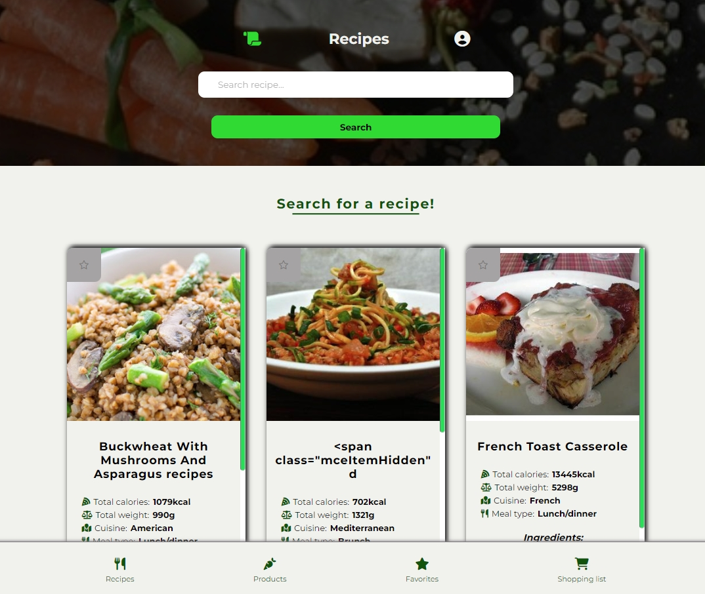

<h1>NutriCuisine</h1>

Hello, I present to you my NutriCuisine project. I've always had trouble figuring out what to eat on a given day, and how many calories my meal has. I was also curious about the caloric content of individual products. That's why I decided to create a website that will enable me to do all of this and additionally will be a nice test and a way to expand my skills. The project is created in React using Vite, React Router, React Redux and written in Typescript.
The whole page is responsible, using storage to contain informations - like favorite dishes. Also, the page allows to log in/log out using Firebase and is adapted in terms of accessibility.

I encourage you to check the website - uploaded to netlifly <a href=https://nutricuisine.netlify.app'>NutriCuisine</a>

<h2>📫 Page contains</h2>

- in the guest mode, it is possible to search for recipes, check the detailed information about them and view the caloric content of products,
- when the user is logged in, a shopping list and favorite dishes are also available,
- responsive design,
- accessibility practices,
- using local storage for favorite recipes and shopping list,
- using Firebase to log in/log out.

<h2>🛠 Used tools / programming languages / technologies</h2>

- HTML / CSS,
- React (Vite, React Redux, React Router),
- Typescript,
- Firebase,
- Local Storage
- using [Food API](https://www.edamam.com/),
- git / github.

